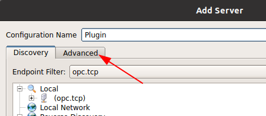
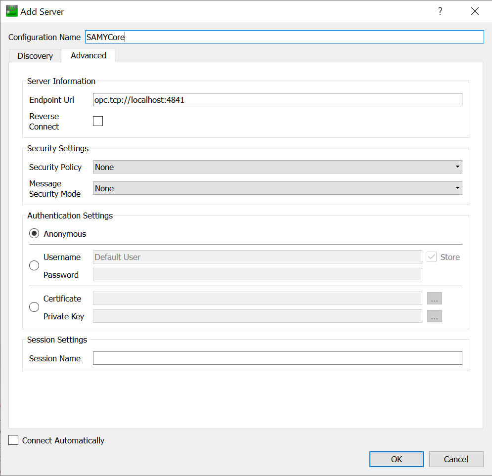
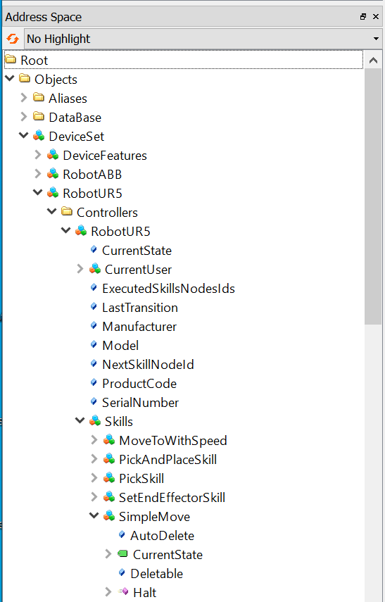

# Writing your first SAMY Plugin

This guide will show you how to write a new samy plugin with the C++ version. In this guide we will work with Ubuntu 20.04 LTS. You have two options to work with the SAMYPlugin template. One is to install the dependencies on your PC, the other is using the virtual machine where everything is preconfigured.

If you want to use the virtual machine, *TODO add link* is the download link. You can skip the first steps and start with **Testing the example plugin**.

# Installing dependencies

First we have to install some dependencies. The main components that are needed to compile a plugin are open62541 and the boost libraries. To be able to compile open62541 we need to install some dependencies with:

```bash
sudo apt install build-essential cmake
```

Install boost with:

```bash
sudo apt install libboost-thread1.71 libboost-dev
```

## Download the files

Download the files from *TODO add link* and extract the folder.

## Install Open64521 OPCUA Library

The open64521 framework needs to be compiled first:

- cd into open62541 folder: `cd open62541_v1.2_unions_fixed`
- create a build folder with: `mkdir build`
- cd into it with `cd build`
- Then run cmake with the following options:

```
cmake -DUA_NAMESPACE_ZERO=FULL \
  -DUA_ENABLE_SUBSCRIPTIONS=ON \
  -DUA_ENABLE_SUBSCRIPTIONS_EVENTS=ON \
    -DUA_ENABLE_DISCOVERY=ON \
    -DUA_ENABLE_DISCOVERY_MULTICAST=ON \
    -DUA_ENABLE_DA=ON \
    -DUA_ENABLE_METHODCALLS=ON \
    -DUA_ENABLE_NODEMANAGEMENT=ON \
    -DUA_ENABLE_MICRO_EMB_DEV_PROFILE=OFF \
    -DUA_ENABLE_PUBSUB=ON \
    -DUA_ENABLE_PUBSUB_ETH_UADP=ON \
    -DUA_ENABLE_PUBSUB_ETH_UADP_ETF=ON \
    -DUA_ENABLE_PUBSUB_FILE_CONFIG=ON \
    -DUA_ENABLE_PUBSUB_INFORMATIONMODEL=ON \
    -DUA_ENABLE_PUBSUB_INFORMATIONMODEL_METHODS=ON \
    -DUA_ENABLE_PUBSUB_MONITORING=ON \
    -DUA_ENABLE_PUBSUB_MQTT=ON \
    -DUA_ENABLE_JSON_ENCODING=ON \
    ..
```

- Build it with `make -j`.
- Once it finished building install it with `sudo make install`

## Compiling the project with CMake

In the downloaded files a `CMakeLists.txt` to build the SAMYPluginLib is already included. There is also a test robot preconfigured. To build the project

- change in the `SamyPluginTemplate_Cpp` folder
- create a build folder `mkdir build`
- cd into it `cd build`
- run cmake `cmake ..`
- and then build it with `make -j`

This created a static library with the plugin internal functions and a test_robot executable that uses the static library.

## Testing the example plugin

If you are using the virtual machine the docker-compose.yml is stored in the folder `~/Desktop/SAMY/SAMYDocker`. Open a terminal in that folder and run `docker-compose up`. Then go to `~/Desktop/SAMY/SamyPluginTemplate_Cpp/build`. (You can also have the SAMYCore running on your host and the plugin in the virtual machine. Then you have to start the plugin with the ip address of your host.) In the virtual machine there is also QtCreator installed. This is an IDE for C++ where the project is already loaded.

If you have set up the environment on your pc:
For testing the plugin you need to have the MinimalUseCase running on your machine. First we will edit the `docker-compose.yml` so that only the core and the config server will be started (You can find the `docker-compose.yml` in the folder where you extracted `MinimalUseCase_dtController.zip`). For this comment out all the services except the `core` and `config` services. Then start the SAMYCore by running `docker-compose up` in the folder where the `docker-compose.yml` is stored. Run the test_robot with:

```bash
./test_robot "ip_of_samy_core" "robot_name" "robot_address"
```

for example:

```bash
./test_robot localhost RobotUR5 12345
```

- **ip\_of\_samy_core:** If the docker image runs on the same computer the address is `localhost`, if not it is the address of the computer where the docker image is running.
- **robot_name:** The robot name as defined in the SAMYCore config files.
- **robot_address:** The test robot does not connect to a controller, so the address can be some random number. \

To send a command manually to the plugin you can use a graphical OPCUA client like UA-Expert (https://www.unified-automation.com/downloads/opc-ua-clients.html).

- Create a new connection with `Add Server`\
 

- Click on Advanced: \


- Change settings to: \


- Click on connect \


- Call the start method of a skill:

    - Navigate in the Address Space to the Skills object of the RobotUR5
    

    - Then right click on the Start method an click on call. In the window that will open click on call again.


## How does the test robot work?

Now lets take a look at how the test robot works. The test robot is a class that provides one method for each CRCL command that it supports. For example for the MoveTo CRCL command there is a method with the same Name. This method will be connected to the MoveTo signal in the `main.cpp`. This means that whenever the plugin gets a MoveTo command this method will be called. The method head has to have the right form, for this example it would be:

```cpp
int MoveTo(UA_MoveToParametersSetDataType* moveTo);
```

The return value has to be an integer, and the method has to take one argument which is a pointer to the corresponding CRCL datatype. Note that the type name consists of "UA_" + the CRCL command name + "ParameterSetDataType"

# Writing the main function

The fist important section is:

```cpp
Signals signals;
Plugin plugin(samyCoreAddress, samyCorePort, &signals);
plugin.running = &running;
```

Here a structure of type Signals is created. The structure holds on boost::signals2 signal for each CRCL command. Then a plugin object of type Plugin is created. After that a Robot object gets created:

```cpp
std::shared_ptr<Robot> robot(new Robot(robotAddress, &signals, &plugin));
```

We need to use a std::shared_ptr to connect methods of this object with the boost signals. In the next bock all the signals get connected with a method of the robot object. Here is a example for the MoveTo command:

```cpp
signals.MoveTo.connect(boost::bind(&Robot::MoveTo, robot, _1));
```

Once the signals are connected we can init the plugin and start listening for CRCL commands from the SAMYCore:

```cpp
UA_StatusCode retval = UA_STATUSCODE_GOOD;
retval = plugin.InitPlugin(robotName);
spdlog::info("Starting RunClient");
retval = plugin.RunClient(1000); // 1000ms timeout
```

# Sending data to the SAMYCore

In the MoveTo method of the test_robot is an example on how to send data to the SAMYCore.

For example, lets write a CRCL\_Pose to the SAMYCore. The first thing we have to do is edit the configuration for the SAMY\_Core to add a information source with the type CRCL_PoseDataType. To do this we start the SAMYCore with docker and enter `localhost:8000` in a web browser. This will open an editor for the SAMYCore config files. Here there is a `InformationSources.yaml` file. You can edit it by right-clicking the file and selecting `Edit`. There is already one information source defined:

```
  - InformationSource:
      InformationSourceName: "GripperHoldsObject"
      DataTypes:
             - Boolean
```

You can see that it has a name and a datatype, which is Boolean. The name will be used to identify it from the plugin and we have to make sure that the data we write in the information source has the same datatype. To create a new information source we add this to the config file:

```
  - InformationSource:
      InformationSourceName: "SuperPose"
      DataTypes:
             - CRCL_PoseDataType
```

Now we have to restart the SAMYCore. Now we want that whenever the plugin recives a moveTo command, the plugin writes a pose to the information source. For that we have to add these lines to the `MoveTo` method of the test_robot:

```cpp
    UA_CRCL_PoseDataType pose1;
    pose1.id = 743;
    pose1.name = UA_STRING( "POSE1" );
    pose1.point.id = 87;
    pose1.point.name = UA_STRING( "POINT NAME" );
    pose1.point.x = 0.987;
    pose1.point.y = 6.543;
    pose1.point.z = 1.467;
    pose1.xAxis.id = 8711;
    pose1.xAxis.name = UA_STRING( "xVector NAME" );
    pose1.xAxis.i = 0.987;
    pose1.xAxis.j = 6.543;
    pose1.xAxis.k = 1.467;
    pose1.zAxis.id = 8764;
    pose1.zAxis.name = UA_STRING( "zVector NAME" );
    pose1.zAxis.i = 5.987;
    pose1.zAxis.j = 8.543;
    pose1.zAxis.k = 121.467;
    UA_NodeId id = plugin->GetInformationSourceNodeId("SuperPose_0");
    bool ret = WriteInfoSource(&pose1, &UA_TYPES_CRCL[UA_TYPES_CRCL_CRCL_POSEDATATYPE],
                    id, plugin->samy_core_client_read);
    if (ret){
        return COMMAND_SUCCESS;
    } else {
        signals->Halt(); // Tells the SAMYCore that the execution of
                         // the skill failed by setting the state of
                         // the skill to halted.
        return COMMAND_ERROR;
    }
```

Here we create an object of CRCL\_PoseDataType. Then we get the UA\_NodeId of the information source node by giving the method `GetInformationSourceNodeId` the name of the information source. The function `WriteInfoSource` takes as arguments a reference to the data, the type of the data, the id of the node and a pointer to the opcua client of the plugin template.\
Now we have to compile and start the plugin again and call the start methode of the SimpleMove skill, as described above. To see if it worked navigate to the `InformationSources` object in UA-Expert, unfold it and drag the `SuperPose` node into the `Data Acess View`. You can then see the values by double-clicking the Value field.

# CRCL Command Topics

More information about the CRCL commands can be found here: https://github.com/usnistgov/crcl/tree/master/schemas . The two important files are DataPrimitives and CRCLCommands.

## List of all supported CRCL commands

- InitCanon
- EndCanon
- Message
- MoveTo
- MoveScrew
- MoveThroughTo
- Dwell
- ActuateJoints
- ConfigureJointReports
- ConfigureJointReport
- SetDefaultJointPositionsTolerances
- GetStatus
- CloseToolChanger
- OpenToolChanger
- SetRobotParameters
- SetEndeffectorParameters
- SetEndeffector
- SetTransAccel
- SetTransSpeed
- SetRotAccel
- SetRotSpeed
- SetAngleUnits
- SetEndPoseTolerance
- SetForceUnits
- SetIntermediatePoseTolerance
- SetLengthUnits
- SetMotionCoordination
- SetTorqueUnits
- StopMotion
- ConfigureStatusReport
- EnableSensor
- DisableSensor
- EnableGripper
- DisableGripper
- EnableRobotParameterStatus
- DisableRobotParameterStatus
