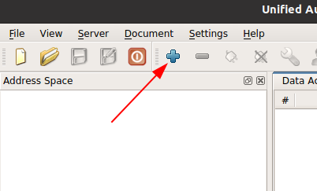
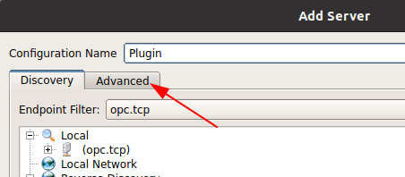
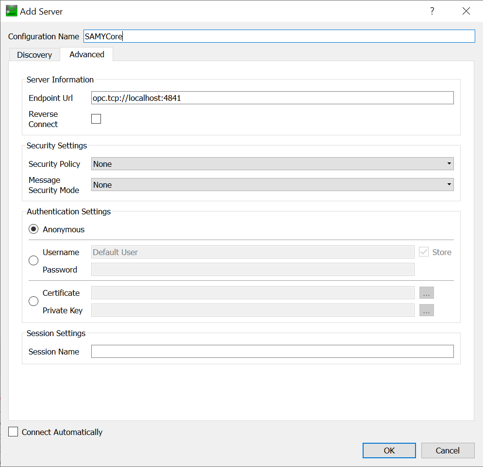
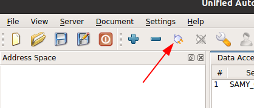
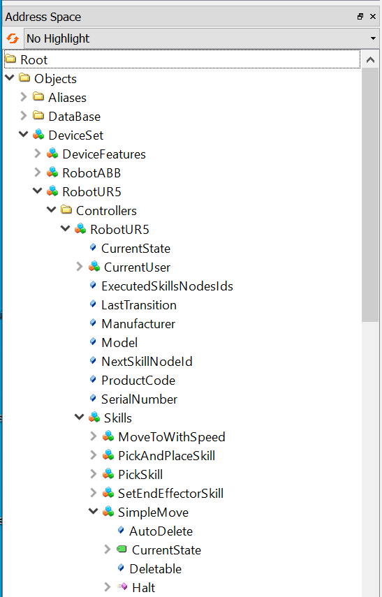

# Writing your first SAMY Plugin

This guide will show you how to write a new SAMY plugin with the python version. It will also explain how to test your plugin by sending a skill manually with the SAMYCore. This guide uses Ubuntu 20.04 but besides creating a virtual environment it will also work the same on a Windows PC. To complete this tutorial you have to completed the MinimalUseCase guide first, as we are going to use some of the docker images from there.

# Creating a virtual environment

The first step is to create an virtual environment with virtualenv. This is not strictly necessary but it is recommended.

- Create a project folder.
- Linux:
	- Install virtualenv with `pip3 install virtualenv`
	- Create a virtual environment with: `python3 -m venv venv`
	- Activate the virtual environment with `source venv/bin/activate`
- Windows:
	- Install virtualenv with `pip install virtualenv`
	- Create a virtual environment with: `python -m venv venv`
	- Activate the virtual environment with `.\venv\Scripts\activate`

# Install the samyplugin package

- Install some dependencies with \
`pip3 install numpy math3d scipy ipython pypubsub python-dateutil pytz lxml cryptography`
- Install the package with `pip3 install samyplugin`

# Create the main file

Create a new file called `main.py`. \
Add those lines:

```
from samyplugin import Plugin

if __name__ == "__main__":

    plugin_object = Plugin()

    plugin_object.connect_to_core("localhost", 4841)
    plugin_object.subscribe_to_core("RobotUR5")

    plugin_object.disconnect_core()
```

Now lets explain what happens in each line. First an instance of the Plugin object is created.

`plugin_object.connect_to_core("localhost", 4841)` connects to the SAMYCore. The first argument is the IP-address of the core, the second the port that is used by the OPCUA server of the core. The port can be defined in the config files of the SAMYCore.  
`plugin_object.subscribe_to_core("RobotUR5")` starts the subscription to the SAMYCore. The argument is the name of the robot as defined in the config files of the SAMYCore. The process will remain in this method, waiting for commands, until the user exits the plugin.  
`plugin_object.disconnect_core()` closes the subscription with the SAMYCore.

# Create your robot object

Now you have to create the object that is going to represent your device. In this tutorial we will create a simple object that prints the data of a moveTo command that the SAMYCore sends.

- Create a file called `robot.py` and add those lines:

```
from pubsub import pub
from samyplugin import CRCL_DataTypes

class Robot():
    def __init__(self):
        pub.subscribe(self.print_move_to, "MoveTo")

    def print_move_to(self, data):
        print(data)
```

#### The important lines are:

```
from pubsub import pub
```

This imports a package that implements the publisher subscriber model. This is used to subscribe methods to the CRCL Topics.

```
pub.subscribe(self.print_move_to, "MoveTo")
```

Here a new subscription is created. The first argument is the method that will be called. The Second is the Topic. There is a topic for each CRCL-Command with the same name as the command. At the end of this guide is a list of all CRCL commands.

```
def print_move_to(self, data):
```

This is the function that is called whenever the plugin receives a MoveTo command from the core. The functions for the subscriptions can only have one argument besides `self`, named `data` in this example. In the `data` variable is the data of the CRCL command. In this case it is a `MoveToParametersSetDataType`. The structure of the data follows the CRCL specification ([https://github.com/usnistgov/crcl/blob/master/schemas/CRCLCommands.xsd](https://github.com/usnistgov/crcl/blob/master/schemas/CRCLCommands.xsd)). An easy way to figure out what data is included is to just print the data to the console.

# Create an instance of robot object

The only thing left to do is to create an instance of a robot object in the main function. For this we have to import the Robot object in the `main.py` file with:

```
from robot import Robot
```

and then create the instance with:

```
robot_object = Robot()
```

The final `main.py` file looks like this:

```
from samyplugin import Plugin
from robot import Robot

if __name__ == "__main__":

    plugin_object = Plugin()
    robot_object = Robot()

    plugin_object.connect_to_core("localhost", 4841)
    plugin_object.subscribe_to_core("RobotUR5")

    plugin_object.disconnect_core()
```

# Testing the plugin

For testing the plugin you need to have the MinimalUseCase running on your machine.  
First we will edit the `docker-compose.yml` so that only the core and the config server will be started (You can find the `docker-compose.yml` in the folder where you extracted `MinimalUseCase_dtController.zip`). For this comment out all the services exept the `core` and `config` services. Then start the SAMYCore by running `docker-compose up` in the folder where the `docker-compose.yml` is stored.  
Now you can run the `main.py` file with `python3 main.py`. To exit the plugin enter `exit` in the command line. To send a command manually to the plugin you can use a graphical OPCUA client like UA-Expert ([https://www.unified-automation.com/downloads/opc-ua-clients.html](https://www.unified-automation.com/downloads/opc-ua-clients.html)).

- Create a new connection with `Add Server`\
 

- Click on Advanced: \


- Change settings to: \


- Click on connect \


- Call the start method of a skill:

    - Navigate in the Address Space to the Skills object of the RobotUR5
    

    - Then right click on the Start method an click on call. In the window that will open click on call again.

# Sending data to the SAMYCore

To send data to the SAMYCore we have to add one line to the `main.py` file before the `subscribe_to_core` method:

```
plugin_object.get_information_source_nodes()
```

This reads all the information sources available in the SAMYCore and makes them available for the robot\_object. For example lets write a CRCL\_Pose to the SAMYCore. The first thing we have to do is edit the configuration for the SAMY\_Core to add a information source with the type CRCL\_PoseDataType. To do this we start the SAMYCore with docker and enter `localhost:8000` in a web browser. This will open an editor for the SAMYCore config files. Here there is a `InformationSources.yaml` file. You can edit it by right-clicking the file and selecting `Edit`. There is already one information source defined:

```
  - InformationSource:
      InformationSourceName: "GripperHoldsObject"
      DataTypes:
             - Boolean
```

You can see that it has a name and a datatype, witch is Boolean. The name will be used to identify it from the plugin and we have to make sure that the data we write in the information source has the same datatype. To create a new information source we add this to the config file:

```
  - InformationSource:
      InformationSourceName: "SuperPose"
      DataTypes:
             - CRCL_PoseDataType
```

Now we have to restart the SAMYCore. We now want that, when we receive a MoveTo command, we write a pose to the information source. For that we have to add these lines to our `print_move_to` method:

```
camera_pose = CRCL_DataTypes.CRCL_PoseDataType()
camera_pose.point.x = 100
pub.sendMessage("write_information_source", name="SuperPose", data=camera_pose);
```

Here we create an object of CRCL_PoseDataType, then assign it the x value 100. Then we send a message to the topic `write_information_source` with the name of the information source and the data. The `samyplugin` module will write the data in the SAMYCore OPCUA server. To see if it worked navigate to the `InformationSources` object in UA-Expert, unfold it and drag the `SuperPose` node into the `Data Acess View`. You can then see the values by double-clicking the Value field.

# CRCL Command Topics

More information about the CRCL commands can be found here: [https://github.com/usnistgov/crcl/tree/master/schemas](https://github.com/usnistgov/crcl/tree/master/schemas) . The two important files are DataPrimitives and CRCLCommands.

# TODO
Erklären wie man die SAMY Config files editiert.


## List of all supported CRCL commands

- InitCanon
- EndCanon
- Message
- MoveTo
- MoveScrew
- MoveThroughTo
- Dwell
- ActuateJoints
- ConfigureJointReports
- ConfigureJointReport
- SetDefaultJointPositionsTolerances
- GetStatus
- CloseToolChanger
- OpenToolChanger
- SetRobotParameters
- SetEndeffectorParameters
- SetEndeffector
- SetTransAccel
- SetTransSpeed
- SetRotAccel
- SetRotSpeed
- SetAngleUnits
- SetEndPoseTolerance
- SetForceUnits
- SetIntermediatePoseTolerance
- SetLengthUnits
- SetMotionCoordination
- SetTorqueUnits
- StopMotion
- ConfigureStatusReport
- EnableSensor
- DisableSensor
- EnableGripper
- DisableGripper
- EnableRobotParameterStatus
- DisableRobotParameterStatus
